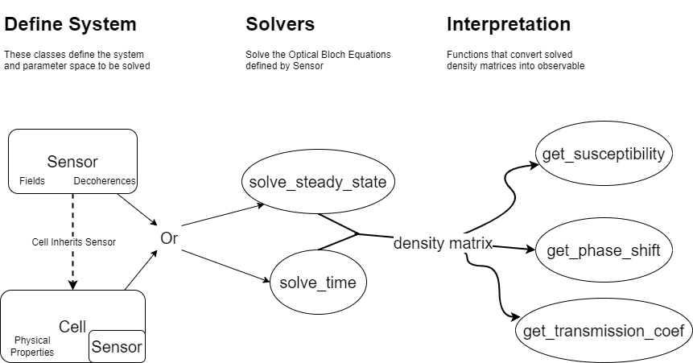

Rydiqule Overview
=================

Rydiqule (RYDberg sensing Interactive Quantum ModULE)
is a python module that can calculate response of a Rydberg sensor to RF fields.
It uses a semi-classical approximation of the Schroedinger equation known as
the Lindblad equation to create equations of motion that describe the interaction
of the sensor with optical and RF fields.

In order to use rydiqule at its basic level, you need to understand a few core elements.
These elements are shown in :numref:`fig-overview`.

.. _fig-overview:

    The basic organizational structure for using Rydiqule.

A calculation needs three general components.

#. Define the system to be solved.
#. Solve the system.
#. Interpret the results to observable quantities.

Define the System
-----------------

A system can be defined using one of two classes: :class:`~.Sensor` or :class:`~.Cell`.
In either case, multiple values for a parameter can be set to produce parameter scans in the solve stage. 
The Sensor class defines the bare minimum of information necessary to produce a system of equations to solve.
This class allows for arbitrary definitions of the system.
The Cell class defines a physical gas of atoms for the system that in turn produces a Sensor for doing calculations.
This class relies on ARC to provide physical parameters.

Solve the System
----------------

We currently have two solvers implemented.

#. A steady state solver (:func:`~.solve_steady_state`) that finds the steady state density matrix of the system.
   This can solve in a few different conditions:

   #. Optically-thin, cold ensemble
   #. Optically-thin, doppler-averaged ensemble

#. A time solver (:func:`~.solve_time`) that allows for fields to be defined arbitrarily in time.

Each solver takes a Sensor or Cell object and solves the system.
The output is the corresponding density matrix in the steady-state, spanning the defined parameter space,
or a series of density matrices versus time in the case of the time solver.

Interpret the Results
---------------------

Once the solultions are made, we need to interpret the density matrices into observable values,
typically some change to the optical probing field.
We implement a few functions to get the :func:`susceptibility <rydiqule.experiments.get_susceptibility>`,
:func:`probe absorption <rydiqule.experiments.get_transmission_coef>`,
and :func:`probe phase shift <rydiqule.experiments.get_phase_shift>`.
Note that getting these values generally requires more information about the system than the bare minimum required to solve them.
:func:`Raw density matrix elements <rydiqule.sensor_utils.get_rho_ij>` can also be obtained.
