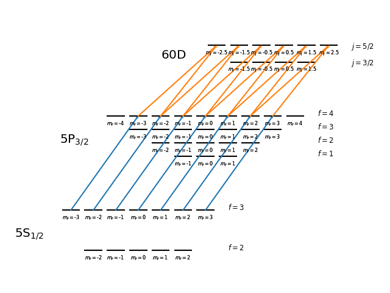
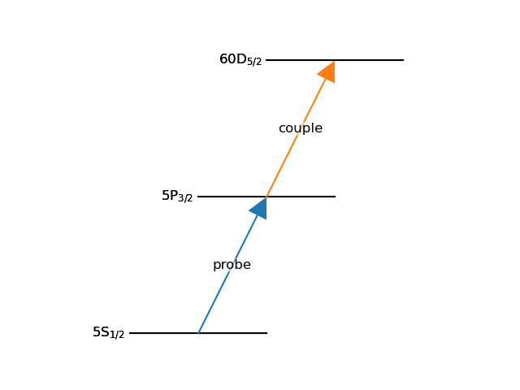

Atomic Structure Primer
=======================

Rydiqule's :class:`~.Cell` class provides an interface to the base :class:`~.Sensor` master equation generation class
that incorporates properties of physical atoms provided by :external+arc:doc:`ARC <index>`.
When using :class:`~.Cell`, you must provide the quantum numbers of each energy level in the system
so that properties of each state (e.g. energies, dipole moments, natural lifetimes, dephasing rates, branching ratios)
can be used to define parameters of the model (e.g. Rabi frequencies, decoherence matrices, etc).

In order to define these quantum numbers correctly for the problem at hand,
some understanding of atomic physics is required.
We briefly outline the most salient details below.
At present, Rydiqule only directly supports Alkali atoms (i.e. atoms with a single valence electron)
via the :external+arc:class:`~arc.alkali_atom_functions.AlkaliAtom` class of ARC.
The following discussion is therefore limited to Alkali atom atomic structure.

Due to fine structure, every electronic energy level of an atom has a principle quantum number :math:`n`,
an angular momentum quantum number :math:`l`,
a spin quantum number :math:`s` (taken to be :math:`1/2` throughout),
and a total electronic angular momentum quantum number :math:`j`.

Each fine structure state :math:`|n,l,j\rangle` has magnetic sublevels,
each with an associated quantum number :math:`m_j` giving the projection of :math:`j` along the quantization axis.
These levels are normally degenerate, unless an external field is applied.
If it's a magnetic field, the resulting splittings are known as the Zeeman effect.
If it's an electric field, the resulting splittings are due to the Stark effect.

Finally, some fine structure states have resolveable structure due to the hyperfine interaction with the atomic nucleus.
These hyperfine states have an additional total angular momentum quantum number :math:`f`.
The magnetic sublevels of a hyperfine state are denoted by :math:`m_f`,
which has a similar role and dependencies as :math:`m_j` in a fine structure state.

In a Rydberg atom, the hyperfine structure of the ground states and first few excited states is resolveable
(though often obscured by doppler averaging in a thermal ensemble).
As a result, these states are typicaly defined by :math:`|n,l,j,f,m_f\rangle`.
This interaction is much less strong for Rydberg states,
so the appropriate quantum numbers to use are the fine structure
:math:`|n,l,j,m_j\rangle`.
As such, fully modeling a real Rydberg atom can require not only a large number of states (:math:`|n,l,j\rangle`),
but they have different relevant quantum numbers (:math:`J` with or without :math:`F`)
and all have many magnetic sublevels (:math:`m_j` or :math:`m_f`).
The level diagram of :numref:`fig-full_structure` shows this complexity.
Within a master equation solver like Rydiqule,
each sublevel of each state must be treated as an independent element in the basis.
Even seemingly simple atomic systems therefore require a computational basis size on the order of a 100,
making solutions computationally difficult.

.. _fig-full_structure:

    A complete 2-photon Rydberg EIT level structure.

Fine Structure without Magnetic Sublevels
-----------------------------------------

There is a common approximation used in the field of Rydberg sensing
to mitigate the need for simulating such large computational bases.
In short, so long as the magnetic sublevels are degenerate,
each :math:`|n,l,j\rangle` state can be modeled as a single level,
as shown in :numref:`fig-nlj_structure`.
In many situations, this is a reasonable approximation and leads to highly accurate models,
especially in thermal ensembles where Doppler-averaging washes out what small non-degeneracies there
may be due to stray fields.

.. _fig-nlj_structure:

    Level diagram of 2-photon Rydberg EIT system using the degenerate sublevels approximation.

A subtlty to using this approximation is in defining the dipole moment of a transition.
The dipole moment depends on the magnetic sublevels of either state, which are ignored by the approximation.
When the sublevels are degenerate, any sublevel with population in it will contribute to an average coupling
based on the dipole-allowed transitions.
For example, a transition between :math:`|5P_{3/2}\rangle` and :math:`|50D_{5/2}\rangle` with a linearly polarized field
has allowed couplings between
:math:`m_j=\pm1/2\rightarrow m_j'=\pm1/2`, and :math:`m_j=\pm3/2\rightarrow m_j'=\pm3/2`.
If all :math:`m_j` sublevels of :math:`|5P_{3/2}\rangle` are equally populated,
the average coupling strength observed with be the average of dipole moment for each sublevel transition.
However, it is common for a single :math:`|m_j|` to be more populated than the others
(due to selection rules in coupling atoms from the ground state to higher excited states),
in which case choosing just one dipole moment may be more accurate.

.. _nlj update:

Migrating Cell from v1 to v2
----------------------------

This section provides a brief description for how to migrate :class:`~.Cell` code
from v1 to v2 of rydiqule.

Original Rydiqule Behavior
++++++++++++++++++++++++++

The original implementation of :class:`~.Cell` solved Rydberg sensing systems under this degenerate approximation.
However, it also required specifying :math:`m_j` for each state.
This was only used to define the dipole moment of the couplings,
effectively using the single sublevel approximation described above for all transitions.
Importantly, specifying this :math:`m_j` did not strictly model single sublevels
(since dephasing rates were only defined by :math:`|n,l,j\rangle`).

Current Rydiqule Behavior
+++++++++++++++++++++++++

In order to properly support fine and hyperfine structure sublevels in :class:`~.Cell`,
we need to make level specification more accurate to the type of model being solved.
To that end, older Rydiqule behavior is specified by only defining states with :math:`|n,l,j\rangle`.
The dipole moment of a transition is found
by taking the average of the allowed transitions between all the available sublevels
(see :meth:`~.RQ_AlkaliAtom.get_dipole_matrix_element` for details).
Calculations that relied on the precise value of the dipole moment,
such as the :doc:`observable functions <observables>`, or couplings defined by their electric field (instead of Rabi frequency)
are expected to return slightly different results.
Otherwise, the behavior will be identical.

Migrating v1 `Cell` code to v2 primarily only involves using :class:`~.A_QState` to define each state,
with only :math:`n, l, j` defined.
There are other smaller differences (such as modified `kvec` definition and other associated ARC automations)
that are described in the :doc:`/changelog` and :class:`~.Cell` documentation.
